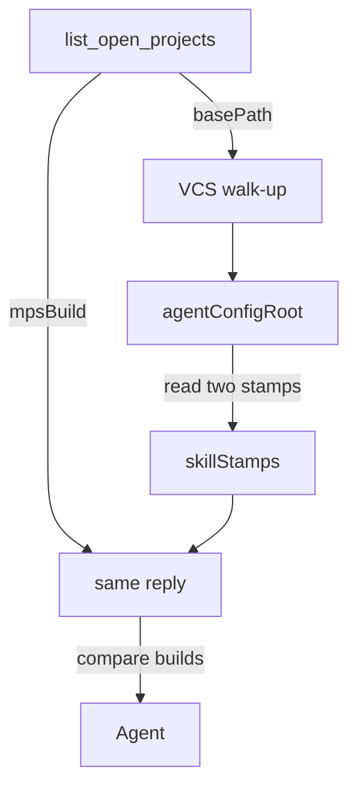

# Requirements

### Overview & Goals

Write one plan document, `d79-skill-stamps-meta-plan.md`, that records the D79 analysis already collected and a concrete implementation plan a later change can follow. The document is the deliverable. Do not implement `skillStamps`, do not edit skill text, and do not change the defect ledger.

Match the style of `d63-module-scope-problem-check-plan.md`: a status line, a pointer at the defect record, `[M]` / `[C]` marking, a short summary, findings, the proposed change, a decisions table, out of scope, and risks. The findings are the explanation already given: what the staleness check is, why it costs a Bash turn, how MPS finds the stamp files, and what “compare that field with `mpsBuild`” means.

### Scope

In scope:

- One new markdown file at `d79-skill-stamps-meta-plan.md`.
- The collected justification, including the subdirectory / `agentConfigRoot` explanation.
- An implementation plan precise enough to carry out later: reply shape, read path, wording sites, tests, propagation, and known limits.

Out of scope for this task:

- Implementing the server read or the wording change.
- Editing `../../../AGENTS.md`, `CLAUDE.md`, skill blueprints, the template, or Kotlin.
- Marking D79 fixed, or adding a link from `study/docs-defects.md`.
- Changing the study harness metric in `skill-optimization-study/references/harness.md`, which mentions `MPS_MCP_SKILL_VERSION.txt` only as a grep target.

### Functional requirements

- Status is plan-only: nothing implemented. Point at D79 in `../study/docs-defects.md` and at round 16 (`HOTSPOT_REPORT_round16.md`, remedy R-g).
- State the measured cost: one `cat` in 9 of 12 runs (examples `S5-sonnet-1:5`, `S6-sonnet-1:4`, `S7-sonnet-1:11`), about one avoidable turn, tier **S** not **D**. The check is right; the transport is wasteful.
- Explain that MPS does not know the agent's working directory and does not need to. `agentConfigRoot` is recomputed from the open project's `basePath` by `AgentConfigRootResolver.deriveAgentConfigRoot`.
- Specify the future change: `mps_mcp_list_open_projects` reads the two stamps under that derived root and returns `skillStamps` on each project entry. The template and the skill stop naming the files as something to open.
- Call out this checkout's exemption (`AGENTS.md:146-148`): a missing stamp here is expected. The plan must not treat that absence as staleness and must not tell a later implementer to edit `../../../AGENTS.md` / `CLAUDE.md` or to run the initializer.
- Include a small diagram of the read path: listing → project base path → VCS walk-up → stamp files → `skillStamps` beside top-level `mpsBuild`.

# Technical Design

### Current implementation

The check the installed guide requires cannot be finished from the listing reply.

- `AGENTS_template.md:113` tells the agent to compare the `build` line in `.agents/skills/MPS_MCP_SKILL_VERSION.txt` and `.claude/skills/MPS_MCP_SKILL_VERSION.txt` with top-level `mpsBuild` from `mps_mcp_list_open_projects`. Lines 115–119 are the rules: equal, continue; different, ask before refresh; missing file, legacy install, not proven staleness; the two stamps disagree, offer one refresh; no `mpsBuild`, do not judge.
- The same “compare its `build`” instruction is in the skill agents load first: blueprint `plugins/mcp-tools/resources/jetbrains/mps/agents/mcp/skills/mps-mcp-workflow/SKILL.md:53`, copied to `../../../.agents/skills` and `.claude/skills/`. `references/mcp-tools-index.md:5` also names the stamp file as the compare source. `JetBrainsMPSInitMcpToolset.kt:39` says the same in the initializer's tool description.
- `mps_mcp_list_open_projects` (`JetBrainsMPSProjectMcpToolset.kt:72-100`) already returns top-level `mpsVersion` / `mpsBuild` / `mpsEap` from `runtimeVersionSource()` (`MpsRuntimeVersion.fromApplicationOrNull()`). Per project, `openProjectJsonObject` (`:511-533`) returns `mpsProjectBaseDirectory`, `ideaBasePath`, and `agentConfigRoot`. It does not read the stamps.
- Stamps are written only by the initializer, last on the success path (`JetBrainsMPSInitMcpToolset.kt:144-156`): the same `MpsRuntimeVersion.toStampText()` bytes at `<target>/.agents/skills/MPS_MCP_SKILL_VERSION.txt` and `<target>/.claude/skills/MPS_MCP_SKILL_VERSION.txt`. Three lines, stable order, trailing newline: `version=`, `build=`, `eap=`. `build` is the staleness key; `version` is what an agent tells the user. A null identity deletes any old stamp. A failed stamp write is a warning, not a failed install.
- `AgentConfigRootResolver.deriveAgentConfigRoot` takes the open project's base path, absolute-normalizes it, and walks parents until a directory contains `.git`, `.hg`, or `.svn`. Existence is enough, so a worktree `.git` file counts. No marker: the project base path itself. Nothing is stored. Every listing recomputes it (`JetBrainsMPSProjectMcpToolset.kt:532`). The initializer uses the same walk unless an explicit absolute `targetDirectory` is passed (`resolveTargetDirectory`, `:200-241`). A relative `targetDirectory` is rejected because it would resolve against the MPS process directory, not the agent's.
- `mpsProjectBaseDirectory` is the folder MPS opened and the path later `mps_mcp_*` calls must pass as `projectPath`. The host matches it as a prefix of `Project.getBasePath()`, so an ancestor — often the agent's CWD — is rejected. `agentConfigRoot` may be that ancestor. The two are kept apart on purpose.
- `describeOpenProjectSafely` (`:493-508`) replaces a whole project entry with an error stub if describing it throws. A stamp read that throws would hide `agentConfigRoot` and the rest of the entry. The read must not throw out of `openProjectJsonObject`.
- This checkout's `AGENTS.md:146-148` is not the installed template. Catalogs are hand-propagated and may be newer than the running plugin. A missing stamp here is expected. `SkillCatalogReplicationTest` is the freshness check. Never run the initializer here.

### Key decisions the document must record

These are the plan's decisions, not open questions. Record them in a decisions table with the rationale.

1. **Per project entry, not top-level.** Stamps belong to an install root. Two MPS projects under one `.git` share one `agentConfigRoot` and one pair of stamps; each entry reports that root and those stamps. A top-level object would hide which root was read.
2. **Both trees always, when a root exists.** `agents` and `claude` are always present. A missing file is `{ "present": false }` with no `build`. An omitted key must mean only “the server did not look”, which is the no-`agentConfigRoot` case. That is how a missing file stays the existing legacy-install rule, and how it stays distinct from an old server.
3. **No `agentConfigRoot`: omit `skillStamps`.** A null `basePath` yields a null root. There is nothing to read. Do not invent `present: false` for a directory the server never had.
4. **Unreadable or no `build`: `present: true`, an `error` string, no `build`.** That is not a legacy install and not a comparable build. The agent must not open the file to recover it.
5. **Reply has no `skillStamps` field at all: do not fall back to `cat`.** The running server is older than the instruction. Do not judge staleness.
6. **Read only the derived root.** An install that passed an explicit `targetDirectory` other than the walk-up result stays invisible. Do not search the agent's CWD, and do not scan ancestors or siblings. Document the limit; do not fix it in D79.
7. **Do not edit this checkout's `../../../AGENTS.md` or `CLAUDE.md`.** The exemption stays. Wording changes go to the template and the skill blueprint, then the blueprint folder is copied over both catalogs.

### Document contents

Write the file in this order. Use the substance below; do not replace it with a pointer at the chat.

**Summary.** D79 is a small protocol gap. Before substantial MPS work the agent must compare installed stamp `build` values with top-level `mpsBuild`. The listing already returns `mpsBuild` and `agentConfigRoot`, but not the stamp contents, so the agent `cat`s files the server can already find. The fix is a read inside `list_open_projects`, plus wording that compares the returned field and forbids opening the files. The staleness rules do not change. The initializer still writes the stamps.

**What the check is.** Quote the role of line 113 and lines 115–119. Say the initializer must not be called just to learn the version: it writes files and aborts when skill folders already exist, and a colliding re-run does not move the stamp.

**What is wrong.** The comparison cannot be done from the tool result. One `cat` per run, 9 of 12, deterministic. Not a wrong instruction and not a failed check. Docs change is only “compare the field the listing now returns.”

**How MPS finds the files.** Two directories, kept apart. `mpsProjectBaseDirectory` / `ideaBasePath` from `Project.getBasePath()`. `agentConfigRoot` from the VCS walk. The agent's CWD is only a first `projectPath` probe and is the wrong directory for stamps whenever the MPS project sits in a subdirectory (mbeddr shape: `.git` at the repo root, project at `tools/BigProject`, stamps at `<repo>/.agents/skills/...`). Nested VCS stops at the inner root. No VCS marker: stamps are expected beside the project, not at the agent's CWD. Explicit `targetDirectory` other than the derived root is the one case the listing will miss. Include this diagram:



**What “compare that field” means.** One wording change. The comparison stays `installed build` vs top-level `mpsBuild`. The left-hand side stops being a file. Sketch the reply:

```json
"skillStamps": {
  "agents": { "present": true, "version": "2026.1", "build": "261.10000", "eap": false },
  "claude": { "present": false }
}
```

Compare `skillStamps.agents.build` and `skillStamps.claude.build` with top-level `mpsBuild`. A missing file is `present: false`. Two different `build` values are the existing “stamps disagree” rule. `version` still comes from the same object and is mentioned only when talking to the user.

### Proposed implementation the document must specify

This is future work. The document describes it; this task does not do it.

**Parse.** Add `MpsRuntimeVersion.parseStampText(text: String)` next to `toStampText()`. Split on newlines, trim, ignore blank lines, match `key=value` (first `=` splits), ignore unknown keys, last duplicate wins. A comparable stamp needs a non-blank `build`. `eap` is included only when the value is exactly `true` or `false` (the writer uses Kotlin's boolean text). `version` is included when non-blank. Do not require the writer's order. A text with no `build` is not a comparable stamp.

**Read.** Add a small public reader the unit tests can call without reflection — `MpsRuntimeVersionTest` already calls public API in `jetbrains.mps.agents.mcp.tools` directly, while private init helpers are reached only by reflection. Suggested home: `plugins/mcp-tools/src/jetbrains/mps/agents/mcp/tools/config/InstalledSkillStamps.kt`, public, beside `AgentConfigRootResolver`. `read(agentConfigRoot: Path): JsonObject` reads exactly:

- `agentConfigRoot.resolve(".agents").resolve("skills").resolve(MpsRuntimeVersion.STAMP_FILE_NAME)`
- `agentConfigRoot.resolve(".claude").resolve("skills").resolve(MpsRuntimeVersion.STAMP_FILE_NAME)`

UTF-8, same as the writer. Cap the read (4 KB is enough for three lines); a larger file, a directory, an IO error, or a text with no `build` becomes `{ "present": true, "error": "<short reason>" }` and no `build`. A missing file is `{ "present": false }`. Never throw. Do not cache: a refresh in the same session must show up on the next listing, and the listing already recomputes `agentConfigRoot` every call.

**Wire.** In `openProjectJsonObject`, after the existing `agentConfigRoot` property, if the derived root is non-null add `skillStamps` from that reader inside the reader's own failure object. If `ideaBase` is null, omit `skillStamps`. Do not take a path from the agent.

**Tool description.** Extend the `mps_mcp_list_open_projects` description (`JetBrainsMPSProjectMcpToolset.kt:65-69`): each project entry's `skillStamps` is the installed identity under that entry's `agentConfigRoot`; a missing file is `present: false`; do not open `MPS_MCP_SKILL_VERSION.txt`. In the initializer description (`JetBrainsMPSInitMcpToolset.kt:39`), replace “compare its `build`” with a pointer at `skillStamps` on the listing. The initializer still writes the files; it does not become the version query.

**Wording.** Rewrite the file-path half only. Leave the staleness rules, and add two bullets: no `build` on a stamp object means do not compare and do not open the file, offer one refresh; no `skillStamps` on the reply means the server is too old to report stamps, do not read the files and do not judge.

Sketch for `AGENTS_template.md:113`:

> Before substantial MPS work, compare `skillStamps.agents.build` and `skillStamps.claude.build` on the relevant project entry of `mps_mcp_list_open_projects` with that reply's top-level `mpsBuild`. Do not open `MPS_MCP_SKILL_VERSION.txt` — absence, a missing `build`, and a read error are whatever `skillStamps` reports. If the reply has no `skillStamps`, the server does not report stamps yet: do not read the files and do not judge staleness. Do not call the initializer to learn the version — it writes files and aborts when skill folders already exist, and a colliding re-run does not move the stamp. A successful refresh overwrites both stamps, which the next listing reports.

The same sentence in `mps-mcp-workflow/SKILL.md:53` and the compare clause in `references/mcp-tools-index.md:5` move with it. A template-only edit leaves the `cat` instruction in the skill agents actually load. `mcp-tools-index.md:5` today says “compare `mpsBuild` with the `build` in `MPS_MCP_SKILL_VERSION.txt`”; that clause has to stop naming the file.

**Propagation, later.** Edit the blueprint under `../resources/jetbrains/mps/agents/mcp/skills/mps-mcp-workflow`, then copy that skill folder over `.agents/skills/mps-mcp-workflow` and `.claude/skills/mps-mcp-workflow`. `SkillCatalogReplicationTest` fails when the three trees differ. Do not run the initializer. Do not edit `AGENTS.md` or `CLAUDE.md`. The template reaches an already-initialized project only when the user merges `agentsFileText` on refresh; existing guide files are never overwritten (`JetBrainsMPSInitMcpToolset.kt:129-141`). The skill text is what stops the `cat` after the next catalog install. Record the `inventorySha256` change in the next study round. Do not mark D79 fixed until the suite is green.

**Size.** About 80 lines of production Kotlin, about 120 lines of tests, and five text sites (template, skill, index, two tool descriptions) plus the two catalog copies. About one turn saved per run.

### Risks the document must name

- A stamp read that throws blanks the project entry via `describeOpenProjectSafely`. The reader must catch.
- Explicit `targetDirectory` ≠ derived root: the listing reports the derived root and will show `present: false` even though stamps exist elsewhere. Say so. Do not search.
- Nested `.git` stops the walk early. Stamps are expected at the inner root.
- Old installed catalogs keep the `cat` sentence until refresh. Shipping the field without the skill sentence, or the sentence without the field, does not remove the turn.
- This checkout's missing stamp must stay “expected”, including after the skill text starts mentioning `skillStamps`.
- Two projects, one root: duplicate `skillStamps` objects. That is correct, not a bug.

# Testing

### Validation approach

This task only adds the plan document. Verify the file, its citations, and that nothing else changed. The test plan below is content the document must contain for the later D79 implementation; do not write those tests now.

### Key scenarios for this task

- `d79-skill-stamps-meta-plan.md` exists and follows the `d63-*.md` plan shape.
- It states the 9-of-12 measurement, the tier **S** remedy, the `skillStamps` shape, and the `agentConfigRoot` walk, including the subdirectory case and the explicit-`targetDirectory` miss.
- It names the concrete edit sites: `JetBrainsMPSProjectMcpToolset.kt` (`openProjectJsonObject` around line 532 and the tool description), `MpsRuntimeVersion.kt`, `AgentConfigRootResolver.kt`, `JetBrainsMPSInitMcpToolset.kt` (stamp write and the description at line 39), `AGENTS_template.md:113-119`, `mps-mcp-workflow/SKILL.md:53`, `references/mcp-tools-index.md:5`.
- It says not to edit `../../../AGENTS.md` / `CLAUDE.md`, not to run the initializer, and not to treat a missing stamp in this checkout as staleness.
- No Kotlin, template, skill, ledger, or guide file is modified.

### Test plan the document must specify for the later implementation

Unit, no MPS project, in the style of `MpsRuntimeVersionTest`:

- `toStampText()` round-trips through `parseStampText` for `version`, `build`, and `eap`.
- Key order does not matter. Blank lines and unknown keys are ignored. A missing or blank `build` is not comparable.
- Temp directory: both stamps present and equal; only `.agents`; only `.claude`; neither file; the two builds differ (the reader returns both; it does not judge).
- A directory where the stamp name should be a file, a file over the size cap, and a text with no `build` each yield `present: true`, an `error`, and no `build`.
- Missing file yields `present: false` and no `build`.

Integration, extend `JetBrainsMPSProjectMcpToolsetIntegrationTest` `list-open-projects reports the current MPS project and selector paths` (`:39-73`). Do not write stamp files into this repo. When `agentConfigRoot` is non-null, `skillStamps.agents` and `skillStamps.claude` are objects. `present: true` implies a non-blank `build`; `present: false` implies no `build`. In this checkout both are expected `present: false` if the stamps are still absent, but the assertion must stay valid if a stamp appears later.

After the later wording change: `SkillCatalogReplicationTest` and `../scripts/validate_skill_catalog.py`. The listing integration test already asserts top-level `mpsBuild` against `MpsRuntimeVersion.fromApplicationOrNull()`; keep that.

### Edge cases the document must keep

- Null project base path: no `agentConfigRoot`, no `skillStamps`, listing still succeeds.
- Shared VCS root, two open projects: both entries carry the same derived root and the same stamp pair.
- `mpsBuild` omitted because the IDE cannot report identity: stamps may still be present; the existing “do not judge” rule applies. The reader does not compare.
- A stamp IO failure must not replace the project entry with the `describeOpenProjectSafely` error stub.

# Delivery Steps

###   Step 1: Write the D79 explanation into the plan document
`d79-skill-stamps-meta-plan.md` exists and records why the stamp check costs a Bash turn and how MPS already knows which directory to read.

- Create the file in the style of `d63-module-scope-problem-check-plan.md`: status line (plan only, nothing implemented), pointer at D79 in `study/docs-defects.md` and at round 16 remedy R-g, and `[M]` / `[C]` marking.
- Write the summary and the “what the check is” section from `AGENTS_template.md:113-119`: compare stamp `build` with top-level `mpsBuild`; equal / different / missing / disagreeing / no `mpsBuild` rules stay as they are; do not call the initializer to learn the version.
- Write the “what is wrong” section: the listing returns `mpsBuild` and `agentConfigRoot` but not the stamp contents, so the agent `cat`s; 9 of 12 runs (examples `S5-sonnet-1:5`, `S6-sonnet-1:4`, `S7-sonnet-1:11`); tier **S**, about one turn; the check is right and the transport is wasteful.
- Write the directory section from `AgentConfigRootResolver.kt` and `JetBrainsMPSProjectMcpToolset.kt:511-533`: `mpsProjectBaseDirectory` is the open project; `agentConfigRoot` is the nearest VCS root walked up from that base path; the agent's CWD is not an input; subdirectory projects (mbeddr `tools/BigProject`) are the reason the two paths differ.
- Include the read-path diagram: listing → base path → VCS walk-up → two stamp files → `skillStamps` in the same reply as `mpsBuild`.
- State this checkout's exemption (`AGENTS.md:146-148`): a missing stamp here is expected and is not the defect.

###   Step 2: Record the skillStamps contract and every wording site
The document specifies the reply shape, the server read, and every sentence that still tells an agent to open the stamp file.

- Add the decisions table: per-entry `skillStamps`; both trees always when a root exists; missing file is `present: false`; omit the object only when `agentConfigRoot` is null; unreadable or no `build` is `present: true` plus `error` and no `build`; no `skillStamps` field means do not fall back to `cat`; read only the derived root.
- Specify `MpsRuntimeVersion.parseStampText` next to `toStampText()`, and a public reader beside `AgentConfigRootResolver` that reads `.agents/skills/MPS_MCP_SKILL_VERSION.txt` and `.claude/skills/MPS_MCP_SKILL_VERSION.txt` under the derived root, UTF-8, size-capped, never throwing.
- Specify the wire-up in `openProjectJsonObject` after the existing `agentConfigRoot` property, and the tool-description edits in `JetBrainsMPSProjectMcpToolset.kt:65-69` and `JetBrainsMPSInitMcpToolset.kt:39`.
- Include the wording sketch for `AGENTS_template.md:113` and the matching edits at `mps-mcp-workflow/SKILL.md:53` and `references/mcp-tools-index.md:5`. Leave lines 115–119, plus bullets for a stamp with no `build` and a reply with no `skillStamps`.
- State propagation: edit the blueprint, copy the `mps-mcp-workflow` folder over both catalogs, do not run the initializer, do not edit `../../../AGENTS.md` or `CLAUDE.md`. Note that an existing guide is not overwritten, so the skill sentence is what stops the `cat` after refresh.
- Explain “compare that field” with the JSON sketch: `skillStamps.agents.build` and `skillStamps.claude.build` versus top-level `mpsBuild`, no second call and no shell.

###   Step 3: Record tests, limits, and risks, then check the file
A later implementer can carry out D79 from the document alone, and this task has not changed plugin code or the defect ledger.

- Add the unit-test list: stamp round-trip, key order, missing file, one tree only, disagreeing builds, directory-instead-of-file, oversized file, text with no `build`.
- Add the integration note: extend `JetBrainsMPSProjectMcpToolsetIntegrationTest` around lines 39–73 to assert the `skillStamps` shape, and do not write stamp files into this repo.
- Add the limits: explicit `targetDirectory` other than the walk-up result is invisible; nested VCS stops early; no VCS marker collapses the root to the project directory; a throwing read must not trigger the `describeOpenProjectSafely` error stub; two projects under one `.git` share one stamp pair.
- Add size and rollout: about 80 lines of Kotlin, about 120 lines of tests, five text sites; the saving shows up only when the field and the skill sentence ship together; record `inventorySha256` in the next study round; do not mark D79 fixed in this document.
- Re-read the new file against `AGENTS_template.md:113-119`, `AgentConfigRootResolver.kt`, `JetBrainsMPSProjectMcpToolset.kt:65-69` and `:511-533`, `JetBrainsMPSInitMcpToolset.kt:39` and `:144-156`, and `mps-mcp-workflow/SKILL.md:53`, and fix any citation that drifted.
- Confirm the only new file is `d79-skill-stamps-meta-plan.md`.