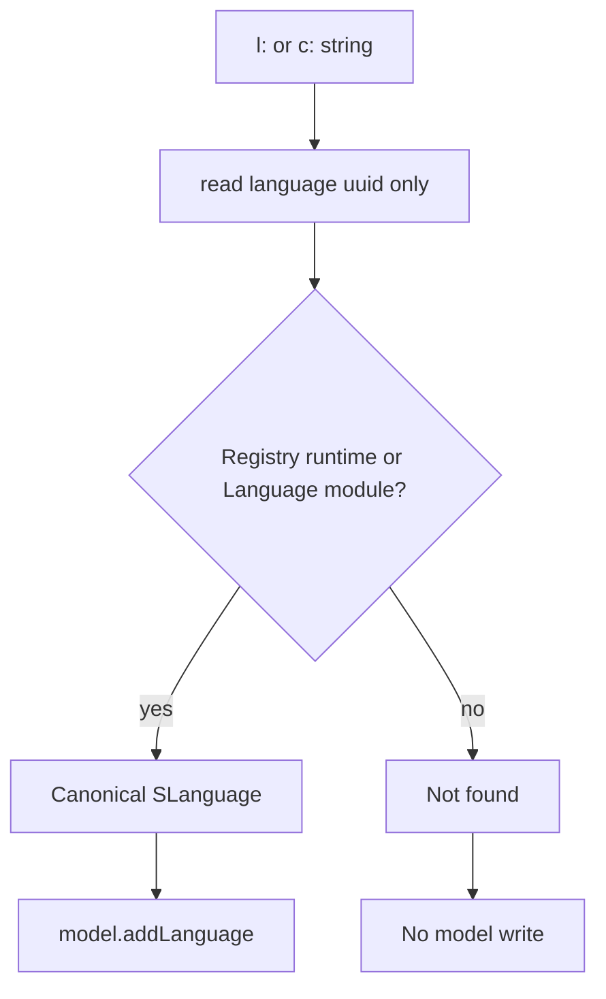

# Requirements

### Overview & Goals
Stop the MCP tools from saving a language id that no loaded language owns. A well-formed `l:` or `c:` string is only a parse, not proof that the language exists. Today two write paths treat that parse as success and call `model.addLanguage`, so an agent can persist an invented UUID.

### Scope
#### In Scope
- Used-language ADD in `mps_mcp_model_used_language` when `usedLanguage` is `l:<uuid>:<name>`.
- Node instantiation that imports `sConcept.language` after resolving a `conceptReference`. In practice this is the child path: nested blueprint children, `mps_mcp_insert_node_from_json` / `update_node`, and console blueprints. A root is pre-checked by `resolveRootableConcept` first (see Current Implementation).
- The shared resolvers those paths use: `resolveLanguage`, `resolveLanguagePreferringProject`, and `resolveConcept` in `AbstractOps.kt`, and the import in `AbstractNodeOps.instantiateNode`.
- Callers that pick up the new resolver behaviour without their own edit: `mps_mcp_get_concept_details`, `mps_mcp_query_structure` (`GET_SUB_CONCEPTS` / `GET_ASSIGNABLE_CONCEPTS` with `languageRefs`), `resolveRootableConcept` / `rootableConceptNotFound`, and `JetBrainsMPSConsoleMcpToolset.resolveBlueprintConcept`.
- Regression coverage in the existing mcp-tools integration tests.

#### Out of Scope
- Used-devkit ADD. `resolveModulePreferringProject` already resolves by module id and stores the live `moduleReference`. An invented devkit UUID fails with `Devkit not found`.
- DELETE of a used language. `removeModelUsedLanguage` must keep parsing the stored `l:` string with `PersistenceFacade.createLanguage` so an already-imported bad id can still be removed. Do not route DELETE through the new check.
- `PersistenceFacade.createLanguage` / `createConcept`, `MetaAdapterFactory`'s adapter cache, and the core adapters. Deserialization is supposed to parse any well-formed string. The bug is persisting that parse.
- `AssignableReferenceService.resolveConcept`. It also calls `createConcept`, but only to score candidates. It does not import a language.
- `findProjectLanguageModule` in `JetBrainsMPSLanguageMcpToolset.kt`. An invented `l:<uuid>:real.name` can still be described as an undeployed project language because the diagnostic falls back to the name after the last colon. That is a label, not a model write.
- `mps_mcp_create_root_node`. It creates the root with `SNodeFactoryOperations.createNewRootNode` and never calls `instantiateNode` or `addLanguage`, so it cannot import an invented id.
- A **real** language imported by a child that the assignability check then rejects. `instantiateNode` imports before `AbstractNodeOps.kt:332` checks the role, so a rejected insert can still add a real language. That is not an invented id; leave it.
- Changing which concept wins when both `concept` and `conceptReference` resolve to different real concepts. `instantiateNode` keeps `byRef ?: byName`.

### Functional Requirements
- An `l:<uuid>:<name>` used-language ADD succeeds only when that uuid is a deployed language or a loaded `Language` module. Otherwise the call returns `Language not found` and the model's used languages are unchanged.
- The ADD path reads only the uuid from the caller's string. It must not build an `SLanguage` from that string (no `PersistenceFacade.createLanguage`), because the adapter it creates is cached under the caller's name.
- When the uuid does resolve, the stored language is the canonical one: `LanguageRuntime.getIdentity()`, or `MetaAdapterByDeclaration.getLanguage(module)` for a language that has never been built. A wrong name with a real id imports that real language under its module name, not the caller's name. For an unbuilt language this holds only when no earlier call cached that id under the wrong name (see Risks).
- Import by plain qualified name still works, including a freshly created unbuilt project language. That path already falls back to the `Language` module and must stay.
- A `c:` / interface concept reference whose language id is not a loaded language does not resolve. A `c:` reference whose language is registered but whose concept id has no descriptor and no declaration does not resolve either.
- When such a reference does not resolve and `concept` is set, the node is built from `concept`, a warning names the ignored reference, and the invented id is not imported. If only the bad reference is set, the call fails and the model's used languages are unchanged. Today the failing call has already imported the invented language before the child's assignability check rejects it.
- The same resolution failure is reported on a dry run. Only the `addLanguage` itself is skipped when `dryRun` is true.
- A real concept reference still resolves, including a `c:<realLangId>/<conceptId>:<name>` whose declaration is in an unbuilt language's structure model, and a compiled concept whose descriptor has no `sourceNode`.
- DELETE of a used language is unchanged: an exact `l:` string still matches `importedLanguageIds()` by language id, whether or not that id would now be accepted on ADD.


# Technical Design

### Current Implementation
`PersistenceFacade.createLanguage` and `createConcept` only deserialize. `SLanguageAdapterById.deserialize` calls `MetaAdapterFactory.getLanguage(id, name)` and does not consult `LanguageRegistry`. `MetaAdapterFactory.getLanguage` (`MetaAdapterFactory.java:84`) caches one adapter per id, and the name of the first call wins. `SLanguage.equals` is id-only, and `getQualifiedName()` returns that cached name when no runtime is deployed. `MetaAdapterByDeclaration.getLanguage(module)` goes through the same cache, so it returns an earlier wrong-name adapter unchanged. `SModel.addLanguage` stores the object it is given.

`resolveLanguage` in `../src/jetbrains/mps/agents/mcp/tools/common/AbstractOps.kt` returns that deserialized adapter for every string that starts with `l:`. `resolveLanguagePreferringProject` short-circuits the same way. `mps_mcp_model_used_language` then calls `model.addLanguage(lang)`. Its unbuilt-language fallback (`resolveModule(mpsProject, usedLanguage, projectOnly = true)`) never runs for an `l:` string, because the short-circuit already succeeded.

`resolveConcept` tries `createConcept` first. If the language is registered but the concept has no `sourceNode`, it keeps the concept as `registeredConcept`, without checking that the concept has a descriptor. If the language is not in the registry it does not return yet, then `resolveConceptNode` looks for a structure-model declaration by module id and concept id. An invented id misses. The last step returns `registeredConcept` if set, else `facade.createConcept(conceptRef)` whenever that parse succeeded, so the name search in the `catch` never runs for a `c:` string.

`instantiateNode` prefers that result over `concept` (`byRef ?: byName`). At `AbstractNodeOps.kt` lines 183–188, it imports `sConcept.language` if it is not already in `importedLanguageIds()`. Only then does it build the node. For a child, the role check `childNode.concept.isSubConceptOf(link.targetConcept)` at line 332 comes after that import. An invented concept fails that check, so today the insert returns an error but the invented language is already in the model's used languages. The tool does not save, but the model is dirty and the next save persists the import.

For a root, `mps_mcp_insert_root_node_from_json` first calls `resolveRootableConcept` (`JetBrainsMPSRootNodeMcpToolset.kt:361`). An invented `c:` ref resolves to an adapter with no descriptor, `isRootable` is false, and the call fails with "not a rootable concept" before `instantiateNode` runs. `mps_mcp_create_root_node` makes the same check and never imports a language. The root path is therefore not where the id leaks, but it changes behaviour: with a valid `concept` beside an invented ref, both tools will now succeed.

A legitimate unbuilt `c:` reference does not need that last step. `resolveConceptNodeInModules` already parses `c:<langId>/<conceptId>:<qualifiedName>` and returns the declaration when the module id matches.

### Key Decisions
- Gate on identity, not on string shape. A language id is acceptable only when `LanguageRegistry.getInstance(repository).getLanguage(SLanguageId)` is non-null, or `repository.getModule(ModuleId.regular(uuid))` is a `Language`. Anything else is not found.
- Look the id up without building an adapter from the caller's string. Parse `l:<uuid>:<name>` with the same two-part shape `SLanguageAdapterById.deserialize` accepts, but keep only the uuid. Otherwise the parse itself caches the caller's name, and an unbuilt language reports that name forever.
- Persist the canonical object, not the caller string. Deployed languages use `LanguageRuntime.getIdentity()`. Unbuilt languages use `MetaAdapterByDeclaration.getLanguage(module)`, which takes the module id and `moduleName`. A real id with a wrong name therefore imports that language, the same way a used-devkit ADD accepts a real id whose typed name is wrong. Do not reject the name mismatch.
- Do not require a concept's `sourceNode` when its language is registered, but do require `isValid()` (a concept descriptor exists, `SAbstractConceptAdapter.java:254`). A compiled concept that is not indexed yet still has a descriptor and keeps resolving. A real language id with an invented concept id has neither descriptor nor declaration and no longer resolves.
- Keep the write-site check even after `resolveConcept` is fixed. `instantiateNode` is the only other `addLanguage` call. If the concept's language does not canonicalize, throw before `addLanguage`. Do not attach the node and do not import the fabricated id. After the resolver changes nothing can reach this guard through a public tool, so no test covers it directly.

### Proposed Changes
Add two helpers next to `resolveLanguage` in `AbstractOps.kt`:

```kotlin
/**
 * Returns the language that owns [id]: the deployed runtime's identity, or, for a language that was
 * never built, the adapter of its loaded `Language` module. Null when neither exists.
 */
protected fun languageForId(repository: SRepository, id: SLanguageId): SLanguage? {
    LanguageRegistry.getInstance(repository).getLanguage(id)?.let { return it.identity }
    val module = repository.getModule(ModuleId.regular(id.idValue)) as? Language ?: return null
    return MetaAdapterByDeclaration.getLanguage(module)
}

/**
 * Reads the uuid out of an `l:<uuid>:<name>` string without deserializing it:
 * [PersistenceFacade.createLanguage] would cache an adapter under the caller's name.
 */
private fun parseLanguageId(languageRef: String): SLanguageId? {
    val parts = languageRef.removePrefix("l:").split(':')
    if (parts.size != 2) return null
    return try {
        SLanguageId.deserialize(parts[0])
    } catch (e: IllegalArgumentException) {
        null
    }
}
```

`resolveLanguage`: on an `l:` string, return `parseLanguageId(languageRef)?.let { languageForId(repository, it) }`. A malformed string or an unknown id returns null. Plain-name lookup against `LanguageRegistry.allLanguages` stays as it is. `resolveLanguagePreferringProject` already delegates `l:` refs here, so `mps_mcp_model_used_language`, `mps_mcp_get_concept_details`, and the structure toolset pick up the check without a second copy. A real unbuilt `l:<moduleId>:<name>` still resolves, because the module lookup uses only the id and does not need a `LanguageRuntime`.

In `mps_mcp_model_used_language`, the module fallback now also runs for a rejected `l:` string. `ModuleReference.parseReference` needs the `<id>(<name>)` shape and throws on `l:…`, and no module is named `l:…`, so it returns null and the call reports `Language not found`. Leave the code. Its comment covers only the plain-name case; add one line saying a rejected `l:` string also reaches it and gets null.

Update the `usedLanguage` description on `mps_mcp_model_used_language`: a persistent reference is accepted only when its id is a deployed language or a loaded `Language` module. An unresolved id is rejected and not stored. The stored name is the language's own name, not the one in the reference.

`resolveConcept`:
- In step 1, keep the registry check. Store a concept with no `sourceNode` as `registeredConcept` only when `isValid()` is true.
- Keep step 2, the declaration-node lookup.
- Delete the unconditional `return facade.createConcept(conceptRef)`.
- Move the registry name scan out of that `catch` and run it last, so a plain name still resolves when `createConcept` throws `FormatException`. It cannot match an invented `c:` string: `asString` of a registered concept only equals a reference that step 1 already returned.
- A parseable reference whose language is unknown, or whose concept id is invalid, now returns null.

`instantiateNode`:
- When `conceptReference` is set and does not resolve, and `concept` does, keep `byRef ?: byName` and add a warning to the existing `warnings` list that names the ignored reference and the JSON path.
- Before the `dryRun` guard, compute `languageForId(repository, MetaIdHelper.getLanguage(sConcept.language))`. Use `mpsProject?.repository ?: model.repository`. If it is null, throw `McpNotFoundException`, so a dry run reports the same failure.
- Inside the existing `!dryRun && model is SModelInternal` block, import that canonical language instead of `sConcept.language`.



### Risks
- Checking only `LanguageRegistry` would reject the unbuilt-language import that `add_model_used_language resolves a freshly-created unbuilt language by plain name` locks in. The module-id fallback is required, and the new `l:` test must use the same unbuilt fixture.
- `SLanguage.equals` is id-only. Tests must assert the stored module id and `qualifiedName`, not only that `addLanguage` was called. A wrong name with a real id is success, not a rejection.
- The adapter cache cannot be cleared. Suppose another call parses `l:<unbuiltId>:wrong.name` first, for example a DELETE (which still uses `createLanguage`) or any other `createLanguage` / `createConcept` of that id. Then `MetaAdapterByDeclaration.getLanguage(module)` returns the wrong-name adapter, and the ADD stores that name until the language is built or MPS restarts. The id is still real, so no invented language is persisted. Accept this, and do not work around it by building a fresh `SLanguageAdapterById`: that would break the one-adapter-per-id identity the rest of MPS relies on.
- The unbuilt wrong-name test catches a regression only if nothing cached the fixture's id first. The fixture is a new `test.lang<nanoTime>` in every test. Build the test's `l:` string from `MetaIdByDeclaration.getLanguageId(language).serialize()`, not from `MetaAdapterByDeclaration.getLanguage(language)`, because the latter caches the real name and makes the test pass whatever the implementation does.
- `get_concept_details` will now see `resolveLanguage == null` for an invented `l:` ref. `findProjectLanguageModule` can still match the name after the last colon and emit the undeployed-language warning. Leave that diagnostic alone; do not treat it as permission to import.
- `isValid()` is false for a concept added to a built language since the last build. Step 2 of `resolveConcept` still finds its declaration, so such a concept keeps resolving. Only a concept with neither a descriptor nor a declaration stops resolving.
- `mps_mcp_create_root_node` and `mps_mcp_insert_root_node_from_json` start accepting an invented `conceptReference` when `concept` is valid. Today both fail with "not a rootable concept". This is intended, and consistent with the child path.


# Testing

### Validation Approach
Add the cases below to the existing integration tests. Do not launch `*McpToolset*IntegrationTest` classes on their own: their environment comes from the `McpToolsIntegrationTestSuite` run configuration (or `McpToolsIntegrationTestSuite (1)`). After the suite exits, search the log for the new test names and for `testFailed`. Confirm the suite ran on JDK 25, and do not start it while another `JUnitStarter` JVM is running.

Also inspect `AbstractOps.kt`, `AbstractNodeOps.kt`, and `JetBrainsMPSModelMcpToolset.kt` with `get_file_problems` after the edit.

### Key Scenarios
- `l:<random-uuid>:jetbrains.mps.lang.editor` on `mps_mcp_model_used_language` returns an error containing `Language not found`. `importedLanguageIds()` does not contain that uuid.
- `l:<real-id>:<real-name>` still adds `jetbrains.mps.lang.core`, and `l:<moduleId>:<moduleName>` still adds the unbuilt `language` fixture. The stored `qualifiedName` and `sourceModuleReference.moduleId` are the module's, not a caller-supplied alias.
- `l:<real-id>:not.the.real.name` adds the real language and stores its real qualified name, for both `jetbrains.mps.lang.core` and the unbuilt `language` fixture. Only the unbuilt case can detect a regression, because the deployed runtime's name hides the cached name.
- `mps_mcp_insert_root_node_from_json` with a `ConceptDeclaration` root and a `propertyDeclaration` child whose blueprint has `concept = jetbrains.mps.lang.structure.structure.PropertyDeclaration` and a `conceptReference` for PropertyDeclaration's concept id under a `UUID.randomUUID()` language succeeds. The child's concept is PropertyDeclaration, the envelope carries a warning about the ignored reference, and `importedLanguageIds()` does not contain the random uuid. Today this call fails the assignability check and leaves the random uuid imported.
- The same child with only that `conceptReference` fails, inserts no root, and `importedLanguageIds()` still does not contain the random uuid.
- The same pair with a real `jetbrains.mps.lang.structure` language id and an unused concept id succeeds from `concept` with a warning. With only that reference, it fails and inserts no root. Today `registeredConcept` makes this reference win and the assignability check rejects the child.

### Edge Cases
- Plain-name ADD of the unbuilt fixture still returns `added: true`. This is the regression for the module fallback.
- A real `c:` reference for a concept in that unbuilt language's structure model still resolves through `resolveConceptNode`, not through `createConcept`.
- DELETE of `jetbrains.mps.lang.core` by its real `l:` string still reports `removed: true`. DELETE must not start requiring the new ADD check.
- An unknown plain name (`totally.unknown.lang`) still returns `Language not found`.
- A malformed `l:` string (`l:not-a-uuid:x`, or `l:<uuid>` with no name) returns `Language not found` and does not throw.
- `mps_mcp_create_root_node` with `concept = jetbrains.mps.lang.structure.structure.ConceptDeclaration` and an invented-language `conceptReference` now succeeds and creates a `ConceptDeclaration`. This locks in the behaviour change; it does not exercise the import, because this tool never imports.

### Test Changes
- Extend `../test/jetbrains/mps/agents/mcp/tools/integration/JetBrainsMPSModelMcpToolsetIntegrationTest.kt` beside `add_model_used_language rejects unknown language` and the unbuilt-language test.
- Extend `../test/jetbrains/mps/agents/mcp/tools/integration/JetBrainsMPSRootNodeMcpToolsetIntegrationTest.kt` beside `insert_root_node_from_json diagnoses incomplete nested child without inserting`, reusing its `conceptDeclarationFqn` / `propertyDeclarationFqn` and `structureModelRef`. Put the `create_root_node` edge case beside `create_root_node creates a named concept declaration in the target model`.
- Build invented references in code, not by editing a model file:
  - For a concept, use `MetaAdapterFactory.getConcept(high, low, conceptId, name)` and serialize it with `PersistenceFacade.asString`. Take the high and low bits from `UUID.randomUUID()` for an invented language, or from the structure language's `SLanguageId` for an invented concept id. Take a real `conceptId` from `MetaIdHelper.getConcept(concept).idValue`.
  - Build a correct-name `l:` reference with `PersistenceFacade.asString` on the registry or declaration language.
  - Build the unbuilt wrong-name reference from `MetaIdByDeclaration.getLanguageId(language).serialize()` (see Risks).
  - None of this depends on `ModuleId.toString()` formatting.


# Delivery Steps

###   Step 1: Reject unresolved language ids on used-language ADD
An `l:` used-language ADD persists a language only when its id is a deployed runtime or a loaded Language module, and stores that language's own name.

- Add `languageForId` and `parseLanguageId` in `../src/jetbrains/mps/agents/mcp/tools/common/AbstractOps.kt`. `languageForId` prefers `LanguageRegistry.getLanguage(SLanguageId).identity`. Otherwise it resolves `ModuleId.regular(uuid)` in the repository and accepts the module only when it is a `Language`, via `MetaAdapterByDeclaration.getLanguage`. `parseLanguageId` reads the uuid without calling `createLanguage`.
- Change `resolveLanguage` so an `l:` string goes through `parseLanguageId` and `languageForId`. Return null when the id does not resolve. Leave the plain-name registry lookup and the unbuilt-name fallback in `JetBrainsMPSModelMcpToolset` as they are. Add one line to that fallback's comment: it now also runs for a rejected `l:` string, and returns null.
- Do not use this check in `removeModelUsedLanguage`. DELETE must keep matching the stored id through `createLanguage`.
- Update the `usedLanguage` parameter description on `mps_mcp_model_used_language` to say an unresolved persistent id is rejected and not stored, and the stored name is the language's own.
- Add integration tests in `JetBrainsMPSModelMcpToolsetIntegrationTest.kt`:
  - an invented `l:` uuid is not imported;
  - a malformed `l:` string is rejected;
  - real `l:` refs for `jetbrains.mps.lang.core` and the unbuilt `language` fixture are imported under the canonical name and module id;
  - a real id with a wrong name stores the real qualified name, for both languages. Build the unbuilt one's string without touching the adapter cache.
- Inspect the edited Kotlin files, then run `McpToolsIntegrationTestSuite` and confirm the new tests and the existing unbuilt-language ADD test.

###   Step 2: Stop node instantiation from importing an invented concept language
A concept reference whose language id is unknown, or whose concept id is invalid, no longer resolves. `instantiateNode` will not import an id that does not canonicalize, including on the failure path.

- In `resolveConcept`:
  - Remove the unconditional `facade.createConcept` return.
  - Keep the registered-language path, including the null-`sourceNode` fallback, but only for a concept whose `isValid()` is true.
  - Keep `resolveConceptNode` for real `c:` refs and unbuilt declarations.
  - Move the plain-name scan out of the `createConcept` catch and run it last, so a name still resolves when parsing throws.
- In `AbstractNodeOps.instantiateNode`:
  - Canonicalize the concept's language with `languageForId` before the `dryRun` guard, and import the canonical language.
  - If canonicalization fails, throw `McpNotFoundException` before any model change, on a dry run as well.
  - When `conceptReference` does not resolve and `concept` does, keep `byRef ?: byName` and add a warning on the existing `warnings` list.
- Add tests in `JetBrainsMPSRootNodeMcpToolsetIntegrationTest.kt`:
  - a nested `PropertyDeclaration` child with an invented-language `conceptReference` and a valid `concept` is created from `concept`, with a warning, and the invented id is not imported;
  - the same reference alone fails, inserts no root, and leaves `importedLanguageIds()` without the invented id;
  - the same pair and single-reference cases with a real structure-language id and an unused concept id;
  - the `create_root_node` behaviour change.
- Inspect the edited files and re-run `McpToolsIntegrationTestSuite`, including the new root-node tests and the existing `create_root_node` and `insert_root_node_from_json` tests.
